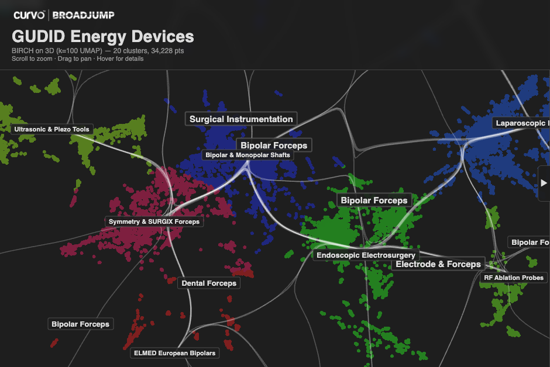

```{=html}
<style>#title-block-header { display: none !important; }</style>

<link href="https://fonts.googleapis.com/css2?family=Montserrat:wght@700&display=swap" rel="stylesheet">

<div class="dyf-hero" style="
  position: relative;
  width: 100%;
  height: 140px;
  border-radius: 8px;
  background: url('hero-bg.png?v=2') center/cover no-repeat;
  overflow: hidden;
  margin-bottom: 1.5em;
">
  <!-- Subtle overlay for text readability -->
  <div style="
    position: absolute;
    inset: 0;
    background: rgba(20, 20, 20, 0.35);
  "></div>

  <!-- Logo — left -->
  <div style="
    position: absolute;
    left: 1.5em;
    top: 50%;
    transform: translateY(-50%);
  ">
    <svg xmlns="http://www.w3.org/2000/svg" viewBox="0 0 170 105" style="width: 130px; height: auto;">
      <defs>
        <linearGradient id="hero-accent" x1="0%" y1="0%" x2="100%" y2="100%">
          <stop offset="0%" stop-color="#e94560"/>
          <stop offset="100%" stop-color="#f9a826"/>
        </linearGradient>
      </defs>
      <text x="4" y="82" font-family="Montserrat, sans-serif" font-size="88" font-weight="700">
        <tspan fill="#f0f0f0">d</tspan><tspan fill="url(#hero-accent)">&#x28e;</tspan><tspan fill="#f0f0f0">f</tspan>
      </text>
    </svg>
  </div>

  <!-- Tagline — lower right -->
  <div style="
    position: absolute;
    right: 1.5em;
    bottom: 1em;
    font-family: Montserrat, sans-serif;
    font-size: 0.8em;
    font-weight: 700;
    letter-spacing: 0.18em;
    color: #999;
  "><span>density </span><span style="background:linear-gradient(to right,#e94560,#f9a826);-webkit-background-clip:text;-webkit-text-fill-color:transparent;background-clip:text;">yields</span><span> features</span></div>
</div>
```

Discover structure in embedding spaces. DYF uses density-based LSH to reveal the natural organization of your data:

- **Dense**: Core items in well-populated semantic regions
- **Bridge**: Transitional items connecting different clusters
- **Orphan**: Unique items with no semantic neighbors

## What it does

DYF transforms raw embeddings into navigable semantic maps. Instead of just clustering, it reveals the *topology* — which regions are dense, which items bridge between concepts, and which are truly unique.

**Use cases:**

- **Semantic navigation**: Find paths between concepts
- **Structure discovery**: Understand how your data organizes itself
- **Anomaly detection**: Identify orphans and bridges
- **Index building**: Pre-compute structure for fast queries

## Installation

```bash
pip install dyf
```

For serialization (save/load indexes):

```bash
pip install dyf[io]
```

For full features (embedding generation, LLM labeling):

```bash
pip install dyf[full]
```

## Quick Start

```python
import numpy as np
from dyf import DensityClassifier

# Your embeddings (e.g., from sentence-transformers)
embeddings = np.random.randn(10000, 384).astype(np.float32)

# Find structure
classifier = DensityClassifier(embedding_dim=384)
classifier.fit(embeddings)

# What did we find?
print(classifier.report())
# Corpus: 10000 items
#   Dense: 9500 (95.0%)
#   Bridge: 450 (4.5%)
#   Orphan: 50 (0.5%)

# Get indices
bridges = classifier.get_bridge()   # Transitional items
orphans = classifier.get_orphans()  # Unique items
```

## How It Works

Two-stage PCA-based LSH:

1. **Initial bucketing**: PCA projections create semantic buckets
2. **Density check**: Items in sparse buckets are candidates for reclassification
3. **Recovery stage**: Coarser PCA finds structure among sparse items
4. **Classification**: Dense (core), Bridge (recovered), Orphan (truly unique)

The key insight: items that appear as outliers globally often share structure at coarser resolution. Bridges are these "misplaced" items — they connect different semantic regions.

## Performance

| Dataset | Time | Per item |
|---------|------|----------|
| 60K embeddings (384d) | ~60ms | 1.0 us |

Rust-accelerated via PyO3. ~4x faster than pure Python.

## See It in Action

[{fig-alt="Interactive 3D visualization of ~34,000 FDA electrosurgical devices showing colored clusters with bridge connections"}](https://jdonaldson.github.io/gudid-energy-landscape/)

[**GUDID Energy Device Landscape**](https://jdonaldson.github.io/gudid-energy-landscape/) — Interactive 3D visualization of ~34,000 FDA electrosurgical devices, built with DYF. Explore dense clusters, bridge devices, and orphan outliers in the embedding space.

## Next Steps

- [Getting Started](getting-started.qmd) — Walkthrough of the core workflow
- [API Reference](reference/index.qmd) — Full API documentation
